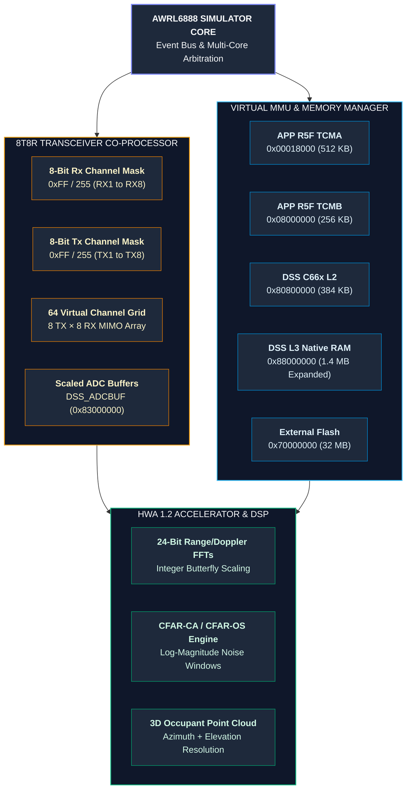

# AWRL6888 (8x8 Transceiver) Functional Mock Simulator Architectural Design

This design specifications document outlines a **register-level and API-level behavioral mock simulator** for the Texas Instruments **AWRL6888 (XWRL688x Platform)**. It scales the previous 4T4R (AWRL6844) design to support a high-resolution **8 Transmit, 8 Receive (8T8R) MIMO array**, generating up to **64 virtual channels** for advanced cabin localization and vital sign tracking.

---

### 1. Architectural Diagram: 8x8 Scaled Simulator Topology

---

### 2. Unified Virtual Memory Map & Translation Layer
The AWRL6888 maintains memory-map compatibility with the xWRL684x family while adjusting internal buffer strides to handle 8 Rx streams simultaneously:

*   **Subsystem Addresses**:
    *   `APP_CPU_ROM_A`: `0x00000000` (Size: 96 KB)
    *   `APP_CPU_TCMA_A`: `0x00018000` (Size: 512 KB)
    *   `APP_CPU_TCMB_A`: `0x08000000` (Size: 256 KB)
    *   `EXT_FLASH_MEM`: `0x70000000` (Size: 32 MB) — Mock QSPI Flash image storage space
*   **DSP Subsystem (DSS)**:
    *   `DSP_L2` (C66x Core Map): `0x00800000` (Size: 288 KB)
    *   `DSS_L2` (System Map): `0x80800000` (Size: 384 KB)
    *   `DSS_L3` (Total Memory): `0x88000000` (Size: 1.4 MB) — Expanded to hold the significantly larger 8T8R 64-channel virtual radar cube.
*   **Virtual ADC Buffer Mapping**:
    *   `DSS_ADCBUF_READ` (`0x83000000`) and `DSS_ADCBUF_WRITE` (`0x83100000`) must be scaled to support 8 simultaneous streams. The simulator intercepts ADC writes and multiplies memory allocation strides by 2 to prevent inter-channel memory corruption.

---

### 3. Core Mock State Machine Implementations

#### A. 8-Bit Transceiver Channel Masking (Base Register: `0x56060000` / APP_CTRL)
The AWRL6888 replaces the traditional 4-bit channel masks with a full **8-bit bitmask register** to configure the 8 receive and 8 transmit antennas:
1.  **Channel Verification**: The simulator traps writes to `channelCfg`. It extracts the RX Mask, TX Mask, and Cascading parameters:
    *   An RX mask of `255` (binary `11111111`) enables all 8 receivers.
    *   A TX mask of `255` (binary `11111111`) enables all 8 transmitters.
2.  **MIMO Calculation**: Upon receiving a `sensorStart` CLI call, the simulator calculates the active MIMO virtual channels:
    $$\text{Virtual Channels} = \text{Count}(\text{Active TX}) \times \text{Count}(\text{Active RX})$$
    If both masks are `255`, the simulator registers **64 virtual channels** and generates a structured mock 3D matrix in L3 memory.

#### B. Scaled HWA 1.2 Post-Processing Emulator
To process 64 virtual channels, the HWA 1.2 emulator must be updated:
1.  **ADC Buffer Integration**: Coordinates with the virtual ADC buffers to stream 8 real-only Rx streams into the HWA memory.
2.  **FFT Scaling**: Validates the 32 HWA Parameter Sets, confirming that the butterfly scaling factors are configured to prevent integer overflows during 2D processing of the massive 64-channel array.

#### C. Multicore Interprocessor Communication (IPC)
Maintains full compatibility with the register-level mailbox structures:
*   Uses `APPSS_CR5A_MBOX_WRITE_DONE` and `APPSS_CR5A_MBOX_READ_REQ` to pass 64-channel coordinate packets to the Cortex-R5F core for transmission over the CAN-FD or high-speed SPI interfaces.
