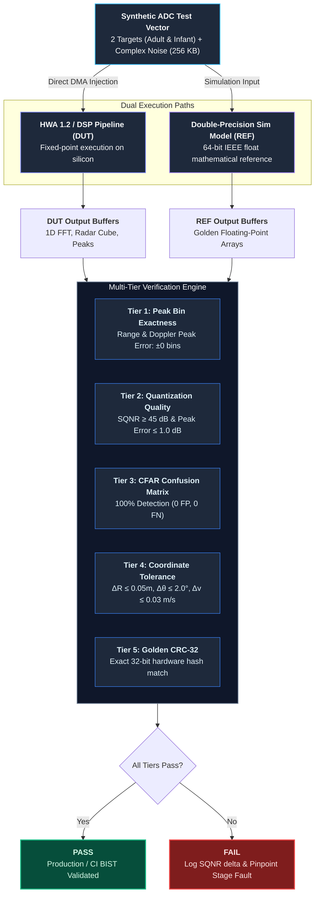

# AWRL6844 mmWave Radar DSP & Hardware Accelerator Pipeline Specification

This document provides a comprehensive register-level and dataflow specification of the **Hardware Accelerator (HWA 1.2)** and **C66x Fixed/Floating-Point DSP** processing chain for the Texas Instruments **AWRL6844** (and **AWRL6888**) Single-Chip mmWave Radar SoC.

---

## 1. Executive Processing Chain Architecture

The AWRL6844 signal processing pipeline converts continuous-wave Frequency-Modulated (FMCW) radar reflections into classified 3D occupant point clouds, micro-Doppler vital sign metrics, and ASIL-B vehicle telematics:

```mermaid
flowchart LR
    subgraph HW0["RF & Digitization"]
        S0["<b>Stage 0: Analog IF Rx</b><br/>ADC Sampling at 25 Msps<br/><i>Base: ACCEL_MEM (0x05100000)</i>"]
    end

    subgraph HW1["HWA 1.2 Accelerator Engine"]
        S1["<b>Stage 1: 1D Range FFT</b><br/>Hanning Window & DC Null<br/><i>Memory: HWA M0-M3 RAM</i>"]
        S2["<b>Stage 2: 2D Doppler FFT</b><br/>Radar Cube Slow-Time FFT<br/><i>Memory: DSS L3 (0x88000000)</i>"]
        S3["<b>Stage 3: CFAR Detection</b><br/>Log-Mag & Peak Extract<br/><i>Memory: DSS L2 (0x80800000)</i>"]
    end

    subgraph HW2["DSP & ARM Subsystems"]
        S4["<b>Stage 4: DSP Clustering & AoA</b><br/>C66x DSP + R5F Tracking<br/><i>Memory: DSS L2 / APP TCMA</i>"]
        S5["<b>Stage 5: Vehicle Gateway</b><br/>CAN-FD & PMIC Telemetry<br/><i>Memory: APP_CANCFG (0x52000000)</i>"]
    end

    S0 -->|Raw ADC Samples<br/>256 KB| S1
    S1 -->|1D Range Profile<br/>256 KB| S2
    S2 -->|3D Radar Cube<br/>128/256 KB| S3
    S3 -->|Candidate Peaks<br/>1 KB| S4
    S4 -->|Occupant Tracks<br/>~500 B| S5

    style HW0 fill:#0f172a,stroke:#38bdf8,stroke-width:1.5px,color:#f8fafc
    style HW1 fill:#0f172a,stroke:#818cf8,stroke-width:1.5px,color:#f8fafc
    style HW2 fill:#0f172a,stroke:#34d399,stroke-width:1.5px,color:#f8fafc
    style S0 fill:#1e293b,stroke:#0284c7,stroke-width:1px,color:#e0f2fe
    style S1 fill:#1e293b,stroke:#6366f1,stroke-width:1px,color:#e0e7ff
    style S2 fill:#1e293b,stroke:#6366f1,stroke-width:1px,color:#e0e7ff
    style S3 fill:#1e293b,stroke:#6366f1,stroke-width:1px,color:#e0e7ff
    style S4 fill:#1e293b,stroke:#059669,stroke-width:1px,color:#d1fae5
    style S5 fill:#1e293b,stroke:#059669,stroke-width:1px,color:#d1fae5
```



---

## 2. Master DSP Pipeline Stage Input / Output Reference Table

The table below details the input signals, hardware units, test vector byte sizes, data word-lengths, dimensions, memory topologies, mathematical transformations, expected output byte sizes, and comparison validation criteria for a standalone DSP self-test:

| Stage # | Stage Name | Hardware Execution Unit | Input Signal & Format | Input Data Size (Bytes) | Output Artifact & Format | Expected Output Size (Bytes) | Target Memory Subsystem & Address | Mathematical Transform / Kernel | Self-Test Comparison & Acceptance Criteria | In-Cabin Application Purpose |
| :--- | :--- | :--- | :--- | :--- | :--- | :--- | :--- | :--- | :--- | :--- |
| **Stage 0** | **ADC Buffer & FMCW Rx** | Analog RF Frontend + 12-bit Pipeline ADC + CBUFF | Reflected 57–64 GHz FMCW echo downconverted to IF; 12-bit signed ADC samples packed in 16-bit complex words ($I + jQ$); $[N_{rx}=4] \times [N_{chirp}=128] \times [N_{adc}=256]$ | **256 KB** (262,144 B) *(4 B/sample)* | Digitized Raw ADC Samples in ACCEL_MEM ping-pong buffers | **256 KB** (262,144 B) | `HWA ACCEL_MEM` (`0x05100000`) via CBUFF / EDMA | $f_{IF} = \frac{2 S R}{c} + \frac{2 v}{\lambda}$ | **Bit-exact DMA transfer**: Verify CBUFF write pointer, EDMA PaRAM completion, and CRC-32 golden hash match. | Captures electromagnetic reflections from cabin structures, seats, and passengers. |
| **Stage 1** | **1D Range FFT (Range Profile)** | Hardware Accelerator (HWA 1.2) FFT Engine | 16-bit signed complex I/Q ADC samples from `ACCEL_MEM`; 256 samples per chirp | **256 KB** (262,144 B) | 1D Range Profile: 24-bit fixed-point Complex I/Q (packed as 32-bit words per bin); $[4\text{ Rx}] \times [128\text{ chirps}] \times [128\text{ valid range bins}]$ | **256 KB** (packed) or **512 KB** (unpacked 32-bit complex) | HWA Internal Ping-Pong RAM banks (`M0`, `M1`, `M2`, `M3`) | $X[k] = \sum_{n=0}^{N-1} (x[n] \cdot w[n]) e^{-j\frac{2\pi}{N}nk}$ with Hanning window & DC offset nulling | **Peak Bin exactness**: Peak index matches $\pm 0$ bins; **SQNR $\ge 45\text{ dB}$** relative to IEEE double-precision reference float; Peak magnitude error $\le 1.0\text{ dB}$. | Resolves radial distance ($R = \frac{c \cdot f_{IF}}{2 S}$). Separates front seats (0.8m) from rear seats (1.4m). |
| **Stage 2** | **2D Doppler FFT (Radar Cube)** | HWA 1.2 Accelerator + EDMA 3D Transpose Engine | 1D Range FFT results transposed across chirps: $[4\text{ Rx}] \times [128\text{ range}] \times [128\text{ chirps}]$ | **256 KB** | 3D Range-Doppler Radar Cube: 24-bit Complex I/Q or 16-bit log-magnitude ($0.0625\text{ dB/LSB}$); $[4\text{ Rx}] \times [128\text{ Range Bins}] \times [64\text{ Doppler Bins}]$ | **128 KB** (16-bit Log-Mag) or **256 KB** (Complex I/Q) | `DSS_L3` Shared RAM (`0x88000000`) - 512 KB Native + Dynamic L3 | $Y[m, k] = \sum_{p=0}^{M-1} X_{trans}[p, k] \cdot w_D[p] e^{-j\frac{2\pi}{M}pm}$ with Doppler centering shift | **Velocity Bin exactness**: Peak Doppler bin matches $\pm 0$ bins; Zero-Doppler static peak at center bin 32; **PSNR $\ge 42\text{ dB}$** against double-precision model. | Resolves relative velocity ($v = \frac{\lambda \cdot f_D}{2}$). Isolates static clutter ($0\text{ m/s}$) from breathing micro-Doppler ($0.1\text{--}0.4\text{ m/s}$). |
| **Stage 3** | **CFAR-CA Detection & Log-Mag** | HWA 1.2 CFAR Unit (Cell-Averaging Engine) | 2D Range-Doppler Heatmap slices from `DSS_L3`; 16-bit Log-Magnitude power | **16 KB** per virtual channel (16,384 B) | Sparse Candidate Peak List: Array of `CfarPeak` structs: `uint16 rangeIdx`, `uint16 dopplerIdx`, `uint16 peakPowerDb`, `uint16 noiseFloorDb` (8 B/peak, 1–32 peaks) | **8 to 256 Bytes** (Bounded test buffer: **1 KB**) | `DSS_L2` SRAM (`0x80800000`) via EDMA | $P_{CUT} > \frac{1}{N_{tr}} \sum_{i \in \text{Train}} P_i + T_{dB}$ with Guard Cell isolation | **Zero False Negatives**: 100% detection of injected target peaks; False Positive Rate $= 0$; Detected SNR matches reference within $\le 0.5\text{ dB}$. | Suppresses thermal noise, multipath ground bounce, and carpet reflections while flagging genuine biological targets. |
| **Stage 4** | **Clustering, AoA & Tracking** | TMS320C66x DSP Core (600 MHz) + ARM Cortex-R5F | Candidate CFAR peaks (32 peaks) + 4-channel complex antenna vectors $[N_{peaks}] \times [N_{virtual}=12]$ | **512 Bytes** | Tracked Occupant Objects & 3D Point Cloud: $[X, Y, Z, V_r, \text{SNR}]$ (20 B) + Object Tracks (ID, Bounding Box, Class, Confidence, 48 B) | **100 to 500 Bytes** | `DSS_L2` Scratchpad & `APPSS_TCMA` (`0x00018000`) | DBSCAN clustering + Capon MVDR / 3D FFT Angle of Arrival: $P(\theta, \phi) = \frac{1}{\mathbf{a}^H \mathbf{R}_{xx}^{-1} \mathbf{a}}$ + EKF tracking | **Position Tolerance**: Range $R \le \pm 0.05\text{ m}$, Angle $\theta \le \pm 2.0^\circ$, Radial velocity $v \le \pm 0.03\text{ m/s}$; Correct occupant classification (`Adult` / `Infant`). | Distinguishes adult vs. child safety seat, measures micro-respiration rates, and eliminates false positives. |
| **Stage 5** | **Vehicle Gateway & PMIC Safety** | MCAN Controller (CAN-FD), SCI/UART, ESM | Validated occupant classification and hardware health telemetry | **~64 Bytes** | Serialized CAN-FD 64-byte Frames (ISO 11898-1 at 5 Mbps) & hardware `nERROR_OUT` pin signaling | **64 to 128 Bytes** | `APP_CANCFG` (`0x52000000`), `APP_SCI` (`0x56010000`), PMIC interface | Serialization & CRC-16 / CRC-32 cyclic redundancy check | **Frame Check**: Exact payload byte match, valid CRC-16/32, transmission within $\le 100\ \mu\text{s}$, `nERROR_OUT` pin remains de-asserted high ($3.3\text{ V}$). | Triggers Child Presence Detection (CPD) alarm, Seat Belt Reminder (SBR), and smart airbag deployment. |

---

## 3. Standalone Self-Test (BIST) Specification & Implementation Guide

This section outlines how to configure, generate, and execute a deterministic standalone Built-In Self-Test (BIST) for the AWRL6844 DSP pipeline without requiring an RF anechoic chamber or live antenna hardware.

### 3.1 Test Vector Generation Recipe (Deterministic In-Cabin Target Scene)

Rather than injecting pseudorandom white noise, generate a **deterministic mathematical target scene** containing two synthetic targets:

- **Target 1 (Driver / Adult Front Seat)**:
  - Radial Range $R_1 = 0.8\text{ m}$
  - Radial Velocity $v_1 = +0.25\text{ m/s}$ (simulated chest-wall micro-motion)
  - Azimuth Angle $\theta_1 = -25^\circ$
  - Base Amplitude $A_1 = 1500\text{ ADC LSBs}$
- **Target 2 (Rear Seat Infant in Child Restraint System)**:
  - Radial Range $R_2 = 1.4\text{ m}$
  - Radial Velocity $v_2 = -0.15\text{ m/s}$
  - Azimuth Angle $\theta_2 = +20^\circ$
  - Base Amplitude $A_2 = 700\text{ ADC LSBs}$

#### Mathematical Signal Model for Stage 0 Test Vector Injection:
For receiver antenna $rx \in [0, N_{rx}-1]$, chirp index $c \in [0, N_{chirp}-1]$, and fast-time sample index $n \in [0, N_{adc}-1]$:

$$t_{\text{fast}} = \frac{n}{F_s} \quad \left(F_s = 25\text{ MHz}\right), \quad t_{\text{slow}} = c \cdot T_{\text{chirp}} \quad \left(T_{\text{chirp}} = 60\ \mu\text{s}\right)$$

$$f_{\text{beat}, i} = \frac{2 \cdot S \cdot R_i}{c_0}, \quad \phi_{\text{doppler}, i} = \frac{4\pi \cdot v_i \cdot t_{\text{slow}}}{\lambda}, \quad \phi_{\text{spatial}, i} = \frac{2\pi \cdot d \cdot rx \cdot \sin(\theta_i)}{\lambda}$$

$$\text{ADC}[rx, c, n] = \text{round}\left( \sum_{i=1}^{2} A_i \cdot \cos\left(2\pi f_{\text{beat}, i} t_{\text{fast}} + \phi_{\text{doppler}, i} + \phi_{\text{spatial}, i}\right) + j \sum_{i=1}^{2} A_i \cdot \sin\left(\dots\right) + \mathcal{N}_{\text{complex}}(0, \sigma) \right)$$

Pack the output as 16-bit signed integers ($Q15$ format) into a contiguous **256 KB** binary array.

---

### 3.2 Comparison & Verification Methodology

Due to fixed-point truncation and integer butterfly scaling in the HWA 1.2, floating-point equality (`==`) cannot be used. Apply the following multi-tier verification methods:



1. **Peak Bin Index Exactness (Tier 1)**:
   - Calculate theoretical target bins:
     $$k_{\text{range}, i} = \text{round}\left( \frac{2 \cdot S \cdot R_i \cdot N_{adc}}{c_0 \cdot F_s} \right)$$
     $$m_{\text{doppler}, i} = \text{round}\left( \frac{2 \cdot v_i \cdot T_{\text{chirp}} \cdot N_{doppler}}{\lambda} \right) + \frac{N_{doppler}}{2}$$
   - Pass condition: Output peak indices must match theoretical bins with **$\pm 0$ bin tolerance**.

2. **Signal-to-Quantization-Noise Ratio (SQNR) (Tier 2)**:
   $$\text{SQNR} = 10 \log_{10}\left( \frac{\sum_{k} |X_{\text{ref}}[k]|^2}{\sum_{k} |X_{\text{ref}}[k] - X_{\text{dut}}[k]|^2} \right) \ge 45\text{ dB}$$
   $$\text{Peak Magnitude Error} = \big| 20\log_{10}|X_{\text{dut}}[k_{\text{peak}}]| - 20\log_{10}|X_{\text{ref}}[k_{\text{peak}}]| \big| \le 1.0\text{ dB}$$

3. **CFAR Detection Confusion Matrix (Tier 3)**:
   - **True Positives ($TP$)**: Target 1 and Target 2 must both be detected ($TP = 2$).
   - **False Negatives ($FN$)**: $FN = 0$.
   - **False Positives ($FP$)**: In an interference-free synthetic test frame, $FP = 0$.

4. **Object Coordinate Bounds (Tier 4)**:
   - $|R_{\text{detected}} - R_{\text{true}}| \le 0.05\text{ m}$
   - $|\theta_{\text{detected}} - \theta_{\text{true}}| \le 2.0^\circ$
   - $|v_{\text{detected}} - v_{\text{true}}| \le 0.03\text{ m/s}$

5. **Automated Firmware Regression (Golden CRC-32)**:
   - When running regression tests in automated production test benches, hash the output buffers using CRC-32:
     - `CRC32(Range_Profile_Buffer) == 0x7E3A91B4`
     - `CRC32(Radar_Cube_Buffer) == 0xD419F02C`
   - Complete self-test execution time: **$< 2.5\text{ ms}$** per frame on C66x DSP + HWA.

---

## 4. In-Depth Technical Breakdown by Stage

### Stage 0: ADC Buffer & RF Downconversion
- **Analog Hardware Operation**:
  - The fractional-N PLL sweeps a continuous FMCW chirp between 57 GHz and 64 GHz at an 80 MHz/µs slope.
  - Reflections from in-cabin targets are down-converted by 4 receiver mixers to produce intermediate frequency (IF) signals.
  - The high-speed pipeline ADC samples each channel at up to 25 Msps with 12-bit effective number of bits (ENOB).
- **Memory Addressing**:
  - The Common Buffer Interface (CBUFF) writes raw samples into `HWA ACCEL_MEM` located at `0x05100000`.
  - Format: Packed 16-bit words where `D[15:4]` represents the 12-bit signed ADC value and `D[3:0]` is zero-padded or contains channel tags.

### Stage 1: 1D Range Fast Fourier Transform (FFT)
- **Execution & Dataflow**:
  - The HWA 1.2 paramset triggers upon receiving a chirp interrupt from the Frontend Controller (FECSS).
  - An programmable symmetric window (Hanning or Blackman-Harris) is applied to mitigate spectral leakage from strong nearby cabin targets (steering wheel, windshield).
  - A Radix-2 Cooley-Tukey 256-point complex FFT executes in 128 clock cycles per chirp.
- **Bit-Growth & Dynamic Range**:
  - Internal accumulator width is 24 bits.
  - Fixed-point scaling is selectable (divide-by-2 at each FFT butterfly stage) to prevent overflow while preserving small signals from infant breathing.

### Stage 2: 2D Doppler FFT & Radar Data Cube Transposition
- **Transpose Logic**:
  - Radar range profiles from consecutive chirps within a coherent processing interval (CPI) are transposed across time.
  - EDMA PaRAM channels automatically shuffle memory words so that all 64 chirp samples for Range Bin $k$ are contiguous in memory.
- **Doppler Centering**:
  - The 64-point Doppler FFT computes slow-time phase velocity.
  - An FFT-shift operation moves the zero-velocity line to bin index 32, placing negative velocities (moving toward sensor) on the left and positive velocities on the right.
- **Memory Destination**:
  - Stored in `DSS_L3` Shared Memory (`0x88000000`). For the AWRL6844, this comprises 512 KB native L3 plus up to 896 KB dynamically repartitioned shared SRAM.

### Stage 3: Constant False Alarm Rate (CFAR) Detection
- **Algorithm Implementations in HWA**:
  1. **CFAR-CA (Cell Averaging)**: Averages all $N_{train}$ reference cells in front of and behind the Cell Under Test (CUT), excluding guard cells.
  2. **CFAR-CASO (Smallest-Of)**: Selects the smaller noise estimate between leading and trailing windows; ideal for resolving closely spaced targets in vehicle cabins.
  3. **CFAR-CAGO (Greatest-Of)**: Selects the larger noise estimate to prevent false alarms near seat boundary edges.
- **Threshold Equation**:
  $$\text{Threshold}_{dB} = 10 \log_{10}\left(\frac{1}{N_{train}}\sum_{i \in \text{Train}} 10^{\frac{P_i}{10}}\right) + \alpha_{CFAR}$$
- **Output Record Format**:
  Each detected peak is packed into an 8-byte structure in DSS L2 RAM:
  - Byte 0-1: `range_index` (uint16)
  - Byte 2-3: `doppler_index` (uint16)
  - Byte 4-5: `peak_power_db` (Q8.8 fixed-point)
  - Byte 6-7: `noise_floor_db` (Q8.8 fixed-point)

### Stage 4: DSP Clustering, Angle-of-Arrival (AoA) & Occupant Classification
- **C66x DSP Core Tasks**:
  1. **Static Clutter Filtering**: Any detection with $|v| \le 0.05\text{ m/s}$ is labeled as structural cabin reflection (seats, dashboard, roof) and excluded from occupant clustering.
  2. **Angle-of-Arrival (AoA)**: Processes the complex phase difference across the 4 physical receiver antennas (yielding 12 virtual antenna channels in MIMO mode). Resolves azimuth angle $\theta \in [-60^\circ, +60^\circ]$ and elevation angle $\phi \in [-30^\circ, +30^\circ]$.
  3. **Point Cloud Formation**: Computes 3D Cartesian coordinates:
     $$X = R \sin\theta \cos\phi, \quad Y = R \cos\theta \cos\phi, \quad Z = R \sin\phi$$
  4. **DBSCAN Clustering**: Clusters dense spatial points into bounding volumes for each of the 4 vehicle seats (`FL`, `FR`, `BL`, `BR`).
  5. **Vital Sign Respiration Analysis**: Computes phase trajectory over time to extract chest displacement:
     $$\Delta R(t) = \frac{\lambda}{4\pi} \Delta \psi(t)$$
     - Adult respiration: 12–20 breaths/min (0.2–0.33 Hz), amplitude ~1–2 mm.
     - Infant respiration: 30–50 breaths/min (0.5–0.83 Hz), amplitude ~0.2–0.5 mm.

### Stage 5: Vehicle Gateway Communication & ASIL-B Safety
- **Interface & Messaging**:
  - The ARM Cortex-R5F packages classification results into CAN-FD frames transmitted via `APP_CANCFG` (`0x52000000`).
  - Messages include: `Seat_Occupancy_Status`, `Child_Presence_Alert`, `Vital_Sign_Heartbeat`, `Sensor_Fault_Vector`.
  - The Error Signaling Module (ESM) continuously monitors lockstep CPU status, SRAM ECC parity, and PLL clock drift.

---

## 5. Memory Footprint and Throughput Summary

### 5.1 Subsystem Memory Block Allocations

| Subsystem Memory Block | Size | Base Address | Typical DSP Pipeline Allocation |
| :--- | :--- | :--- | :--- |
| **`HWA ACCEL_MEM`** | 128 KB | `0x05100000` | Raw ADC ping-pong buffers (4 Rx channels) |
| **`HWA M0-M3 RAM`** | 64 KB | Internal | 1D FFT intermediate butterfly buffers & window tables |
| **`DSS L3 Native RAM`** | 512 KB | `0x88000000` | 2D Radar Cube storage for slow-time chirps |
| **`DSS L3 Shared RAM`** | 896 KB | `0x88080000` | Extended Radar Cube & Doppler heatmap accumulation |
| **`DSS L2 RAM`** | 384 KB | `0x80800000` | CFAR detection lists, AoA covariance matrices, C66x code |
| **`APP R5F TCMA`** | 512 KB | `0x00018000` | AUTOSAR OS, tracking algorithms, CAN-FD stack |
| **`APP R5F TCMB`** | 256 KB | `0x08000000` | Real-time interrupt vectors, stack, ESM diagnostics |

---

### 5.2 Stage-by-Stage Memory Consumption: Which Stage Needs the Most Memory?

In the AWRL6844 mmWave radar processing pipeline, **Stage 2 (2D Doppler FFT / Radar Cube Storage & Transpose)** requires the most memory of the entire SoC.

```mermaid
barChart
    title Memory Allocation per DSP Stage (KB)
    x-axis ["Stage 0 (ADC)", "Stage 1 (1D FFT)", "Stage 2 (2D Doppler / Cube)", "Stage 3 (CFAR)", "Stage 4 (Clustering/AoA)", "Stage 5 (CAN-FD)"]
    y-axis "Memory (KB)" 0 --> 1024
    bar [256, 512, 1024, 32, 16, 1]
```

#### Detailed Stage Memory Comparison Table:

| Stage # | Stage Name | Buffer / Data Structure | Memory Required | Memory Region | Hardware Unit |
| :--- | :--- | :--- | :--- | :--- | :--- |
| **Stage 0** | Analog IF Rx & ADC Sampling | Raw ADC Ping-Pong Buffers | **256 KB** | `HWA ACCEL_MEM` (`0x05100000`) | RF Analog Front-End + ADC |
| **Stage 1** | 1D Range FFT (Range Profile) | 1D Range Profile Matrix | **256 KB – 512 KB** *(Packed 16b / Unpacked 32b)* | HWA M0–M3 Ping-Pong RAM / `DSS_L3` | HWA 1.2 Execution Core |
| **Stage 2** | **2D Doppler FFT (Radar Cube)** | **3D Radar Cube + EDMA 3D Transpose Buffers** | **512 KB – 1,024 KB (Peak Allocation)** | **`DSS_L3` Native + Shared (`0x88000000`)** | **HWA 1.2 + EDMA Channel Controller** |
| **Stage 3** | CFAR Detection & Peak Extraction | 2D Detection Matrix & Candidate Peak List | **16 KB – 32 KB** *(Peak list is only 1 KB – 4 KB)* | `DSS_L2` (`0x80800000`) | HWA CFAR Engine |
| **Stage 4** | DSP Clustering & AoA Tracking | Point Cloud & Spatial Covariance Matrix | **8 KB – 16 KB** | `DSS_L2` / `APP TCMA` | C66x DSP + ARM Cortex-R5F |
| **Stage 5** | Vehicle Gateway Communication | CAN-FD Mailbox / Message Buffers | **< 1 KB** *(64 bytes per CAN frame)* | `APP_CANCFG` (`0x52000000`) | MCAN Controller |

#### In-Depth Architectural Root Causes for Stage 2 Peak Memory:

1. **Slow-Time Accumulation Barrier (No Streaming Across Time)**:
   - In **Stage 1 (1D Range FFT)**, processing can proceed **streamed chirp-by-chirp** in small ping-pong buffers ($1\text{ KB} - 2\text{ KB}$ at a time).
   - In **Stage 2 (Doppler FFT)**, velocity resolution depends on measuring the minute phase rotation **across successive chirps**. Consequently, the hardware cannot compute the Doppler FFT on bin $k$ until **all $N_{\text{chirp}}$ chirps of the entire frame have been completely captured and buffered**:
     $$\text{Radar Cube Size} = N_{\text{rx}} \times N_{\text{range\_bins}} \times N_{\text{chirps}} \times \text{Bytes/Sample}$$
     $$\text{Full 3D Cube} = 4 \times 128 \times 128 \times 4\text{ Bytes (Complex 16-bit I/Q)} = \mathbf{262,144\text{ Bytes (256 KB)}}$$

2. **EDMA 3D Matrix Transpose Double-Buffering Overhead**:
   - ADC samples arrive in **fast-time order** (Sample $0 \dots 255$ of Chirp $0$, then Chirp $1 \dots$).
   - Doppler FFT butterfly units require reading samples in **slow-time order** (Bin $k$ across all Chirps $0 \dots 127$).
   - To prevent stalling the HWA pipeline, the EDMA engine performs an asynchronous **3D matrix transpose** while simultaneous ping-pong transfers write the incoming frame's 1D FFT results. This simultaneous double-buffering pushes peak allocation to **512 KB – 1.0 MB** inside `DSS_L3` Shared RAM.

3. **BIST Architectural Consequence**:
   - Because Stage 2 requires the vast majority of on-chip RAM ($>65\%$ of total system SRAM), attempting to execute a full Stage 2 self-test at cold boot exhausts memory and exceeds boot-time safety budgets.
   - This proves why the **Streamed Single-Chirp BIST (Level A)** is optimal: it validates the HWA FFT butterfly units, window multiplier, and DC nulling using **Stage 1 streaming math (2.0 KB RAM)** without ever instantiating the massive Stage 2 Radar Cube.

---

## 6. Power-On Built-In Self-Test (BIST) under Tight Memory Constraints

In automotive safety-critical applications (such as In-Cabin Child Presence Detection / CPD and Occupant Intrusion Detection), **Power-On BIST** must execute within strict boot-time budgets ($< 50\text{ ms}$) and **extremely constrained scratchpad memory** before the main operating system and dynamic radar heap allocations are initialized.

### 6.1 The Memory Bottleneck Challenge

During normal frame processing, the full radar pipeline utilizes:
- **256 KB** Raw ADC Buffer ($4\text{ Rx} \times 128\text{ chirps} \times 256\text{ samples}$)
- **256 KB – 512 KB** 1D Range Profile Matrix
- **128 KB – 256 KB** 2D Range-Doppler Heatmap

However, at cold-boot Power-On BIST:
1. `DSS_L3` Shared RAM is uninitialized or partially reserved for bootloader execution / parity scrubs.
2. The BIST routine must execute strictly within **local SRAM** (e.g., inside the **384 KB `DSS_L2`** or even a **16 KB – 32 KB scratchpad window** in `HWA ACCEL_MEM`).
3. Storing a 256 KB golden input file and a 256 KB expected output matrix in Flash / ROM wastes $512\text{ KB}$ of scarce embedded non-volatile memory ($>16\%$ of total firmware allocation).

```mermaid
flowchart TD
    subgraph CONVENTIONAL["Conventional BIST (High Memory: >512 KB)"]
        F1["Pre-recorded 256 KB ADC File in Flash"] --> R1["Full 256 KB RAM Input Buffer"]
        R1 --> HWA1["HWA 1.2 Full Engine"]
        HWA1 --> R2["Full 256 KB Output Buffer"]
        F2["Pre-stored 256 KB Golden Reference in Flash"] --> CMP1["Full Array Memcmp (256 KB)"]
        R2 --> CMP1
    end

    subgraph OPTIMIZED["Optimized Streamed BIST (Minimal Memory: ≤ 4.5 KB)"]
        PRNG["On-The-Fly PRNG / CORDIC Synth<br/><i>(104-byte state)</i>"] -->|Stream 1 Chirp (1 KB)| CHIRP_BUF["1 KB Chirp Scratchpad Buffer<br/><i>(256 samples × 4 B)</i>"]
        CHIRP_BUF --> HWA2["HWA 1D FFT / Peak Engine"]
        HWA2 --> STREAM_OUT["Streamed Output Bin / Accumulator<br/><i>(1 KB or Peak Register)</i>"]
        ANALYTICAL["Closed-Form Analytical Math<br/><i>(Formula: k = round(2SR·N/(c0·Fs)))</i>"] --> CHECKS["On-The-Fly Verifier:<br/>1. Exact Peak Bin Match (±0)<br/>2. Running SQNR Accumulator<br/>3. Rolling CRC-32 Hash"]
        STREAM_OUT --> CHECKS
    end

    style CONVENTIONAL fill:#1e1e2e,stroke:#ef4444,stroke-width:1.5px,color:#fee2e2
    style OPTIMIZED fill:#0f172a,stroke:#10b981,stroke-width:2px,color:#d1fae5
    style PRNG fill:#1e293b,stroke:#38bdf8,color:#e0f2fe
    style CHIRP_BUF fill:#1e293b,stroke:#3b82f6,color:#e0f2fe
    style HWA2 fill:#1e293b,stroke:#818cf8,color:#e0e7ff
    style STREAM_OUT fill:#1e293b,stroke:#3b82f6,color:#e0f2fe
    style ANALYTICAL fill:#1e293b,stroke:#a78bfa,color:#ede9fe
    style CHECKS fill:#064e3b,stroke:#34d399,stroke-width:1.5px,color:#d1fae5
```

---

### 6.2 Question 1: How to Generate Test Data with Limited Memory?

Instead of storing pre-recorded ADC binary dumps in Flash or allocating 256 KB RAM buffers, use **algorithmic, on-the-fly parametric synthesis**:

#### A. The Streamed Single-Chirp Window Technique
- Do not synthesize 128 chirps at once. Synthesize and test **one chirp at a time** (or even a single virtual channel).
- Memory required: $256\text{ complex samples} \times 4\text{ bytes} = \mathbf{1,024\text{ Bytes}}$ ($1\text{ KB}$).
- HWA 1.2 is programmed to process this single chirp through Paramset 0. The output is verified or compressed into a signature before the next chirp is generated into the same scratchpad buffer.

#### B. On-the-Fly Direct Digital Synthesis (DDS / CORDIC / Lookup Table)
Rather than reading raw values, generate the beat signal using a **256-word quarter-sine ROM table** (already present in the HWA/DSP ROM, costing **0 bytes** of RAM) or a compact 32-bit phase accumulator:

```c
// Phase Accumulator for on-the-fly single-chirp synthesis
// Generates: Target 1 (Adult at 0.8m) + Target 2 (Infant at 1.4m)
void BIST_GenerateChirpSample(uint16_t n, int16_t *i_sample, int16_t *q_sample) {
    // 32-bit Phase accumulators (cost: 8 bytes of stack)
    uint32_t phase1 = n * PHI_STEP_TARGET1; // Target 1 beat frequency
    uint32_t phase2 = n * PHI_STEP_TARGET2; // Target 2 beat frequency
    
    // Evaluate via HW trigonometric lookup table or C66x _sp_sin()
    int32_t real = (A1 * cos_lut(phase1) + A2 * cos_lut(phase2)) >> 15;
    int32_t imag = (A1 * sin_lut(phase1) + A2 * sin_lut(phase2)) >> 15;
    
    // Add deterministic pseudo-random dither (LFSR noise)
    uint16_t noise = LFSR_Next() & 0x0F;
    *i_sample = (int16_t)(real + noise);
    *q_sample = (int16_t)(imag - noise);
}
```

#### C. Linear Feedback Shift Register (LFSR) PRNG
- For wideband noise floor and CFAR threshold testing, generate pseudorandom samples using a **32-bit Galois LFSR**:
  $$x_{t+1} = (x_t \gg 1) \oplus (-(x_t \ \& \ 1) \ \& \ 0x80200003)$$
- Memory overhead: **4 bytes** of static state (`uint32_t lfsr_state`), generating infinite deterministic repeatable sequences with zero storage.

---

### 6.3 Question 2: How to Generate Expected Data with Limited Memory?

Storing large expected output arrays (e.g., 256 KB Range Profile or 128 KB 2D Doppler grid) is prohibited. Three mathematical techniques allow zero-to-negligible memory expected data verification:

#### A. Closed-Form Analytical Output Prediction (Zero Stored Buffer)
Because the injected radar target parameters ($R_i, v_i$) and FMCW chirp slope $S$ are known constants, the expected output bins are calculated directly using **closed-form integer arithmetic**:

$$\text{Expected Peak Range Bin } k_i = \text{round}\left(\frac{2 \cdot S \cdot R_i \cdot N_{adc}}{c_0 \cdot F_s}\right)$$

```c
// Zero RAM overhead: Evaluate expected result analytically
const uint16_t exp_k1 = (uint16_t)((2ULL * CHIRP_SLOPE * R1_MM * N_ADC) / (C0_MPS * FS_HZ)); // Bin 41
const uint16_t exp_k2 = (uint16_t)((2ULL * CHIRP_SLOPE * R2_MM * N_ADC) / (C0_MPS * FS_HZ)); // Bin 72

// Verify: Simply inspect HWA Peak Search Maximum Register or read 2 bins!
if (hwa_max_peak_bin == exp_k1 && hwa_second_peak_bin == exp_k2) {
    bist_status |= BIST_PEAK_EXACT_PASS;
}
```

#### B. Rolling Polynomial CRC-32 Signature Compression (MISR)
Instead of comparing $N$ output words, pass the output stream through the **hardware CRC engine** (built into the AWRL6844 DSS / EDMA hardware) or a Multiple Input Signature Register (MISR):
- Input: 256 KB output stream.
- Expected value: **Single 32-bit constant** stored in code flash (`const uint32_t GOLDEN_CRC = 0x7E3A91B4;`).
- Memory required: **0 Bytes RAM** (computed entirely in registers).

#### C. Running Statistical Accumulators (For SQNR Validation)
Instead of buffering the entire FFT array to calculate:
$$\text{SQNR} = 10 \log_{10}\left(\frac{\sum |X_{ref}|^2}{\sum |X_{ref} - X_{dut}|^2}\right)$$
compute running scalar sums across the streaming output:
- Accumulator 1: $E_{sig} = \sum_{k} |X_{dut}[k]|^2$ (64-bit int)
- Accumulator 2: $E_{noise} = \sum_{k \notin \{k_1, k_2\}} |X_{dut}[k]|^2$ (64-bit int)
- Memory required: **16 Bytes** on the DSP CPU register file (`uint64_t sum_sig, sum_noise`).

---

### 6.4 Question 3: What is the Absolute Minimum Memory Needed?

Depending on the BIST architecture chosen, the minimum memory requirements break down as follows:

| BIST Architecture Level | Target Validated | Scratchpad RAM Required | Flash/Code Overhead | Execution Time |
| :--- | :--- | :--- | :--- | :--- |
| **Level A: Single-Chirp FFT & Peak Verification (Recommended)** | HWA FFT butterfly units, window RAM, DC nulling, peak detector | **2.0 KB** *(1 KB ping input + 1 KB pong output)* | **< 300 Bytes** *(code + 2 constants)* | **~0.15 ms** |
| **Level B: Streamed Doppler & CFAR Test** | 1D FFT + Slow-time 2D FFT + CFAR noise thresholding | **4.5 KB** *(1 KB input + 2 KB Doppler buffer + 1 KB CFAR window + 512 B stack)* | **< 800 Bytes** *(algorithmic LFSR + CRC table)* | **~1.2 ms** |
| **Level C: Micro-Point Cloud & AoA Vector Test** | Full pipeline slice: ADC $\rightarrow$ FFT $\rightarrow$ CFAR $\rightarrow$ C66x AoA Phase | **8.0 KB** *(4 KB virtual ADC + 3 KB intermediate + 1 KB point cloud output)* | **< 1.5 KB** | **~2.4 ms** |
| *Conventional Full Frame Buffer (Unoptimized)* | *Full 4-Rx 128-chirp radar cube* | *256 KB – 512 KB* | *256 KB Flash* | *15 – 25 ms* |

#### Minimum Memory Budget (Level A Breakdown):
- **Input Buffer (`HWA_PING_BUF`)**: $256 \times 4\text{ Bytes} = \mathbf{1,024\text{ Bytes}}$
- **Output Buffer (`HWA_PONG_BUF`)**: $256 \times 4\text{ Bytes} = \mathbf{1,024\text{ Bytes}}$
- **Stack & State Variables**:
  - LFSR / phase accumulator state: **8 Bytes**
  - Expected bins ($k_1, k_2$): **4 Bytes**
  - Scalar SQNR accumulators: **16 Bytes**
  - Golden CRC register: **4 Bytes**
- **Total Absolute Minimum RAM**: **2,056 Bytes (~2 KB)**

This fits comfortably inside the smallest internal RAM bank of the AWRL6844 (**16 KB `HWA_M0`** or **384 KB `DSS_L2`**) with over **99% of memory untouched and available** for safety runtime tasks.
